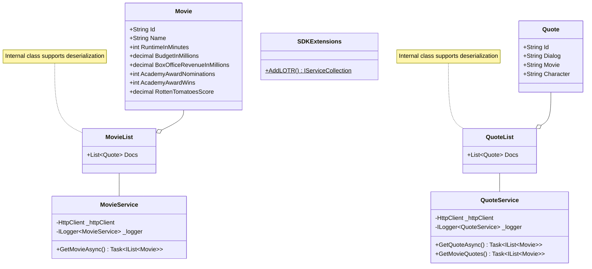

This is a simple SDK designed to support communications with the LOTR API.

Public components include:
- Extension method to load the SDK into the system for use.
- Service classes which drive the communication to the underlying APIs
- Strongly typed models for consumption by SDK consumers

